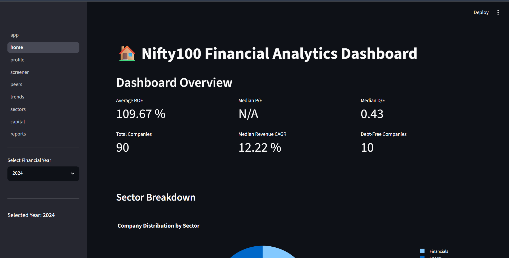
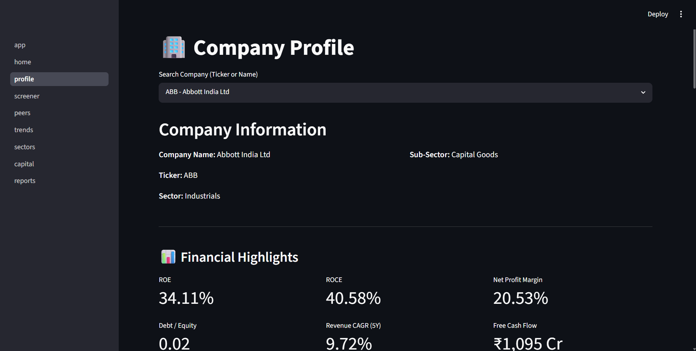
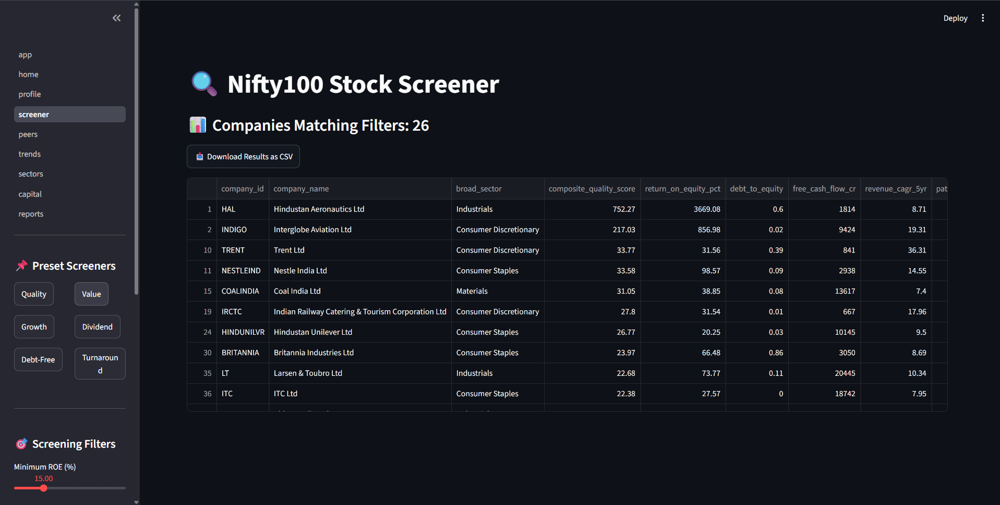
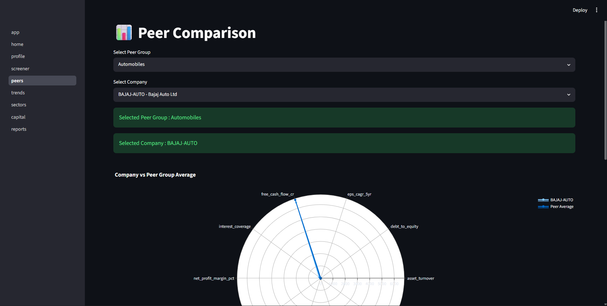
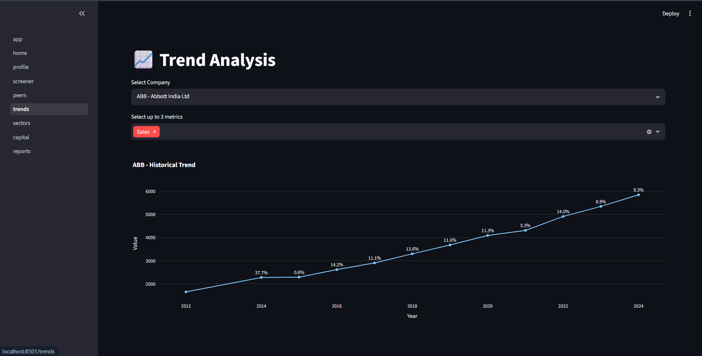
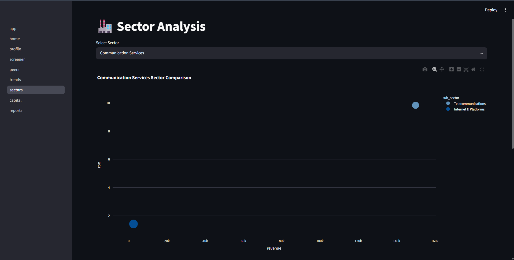
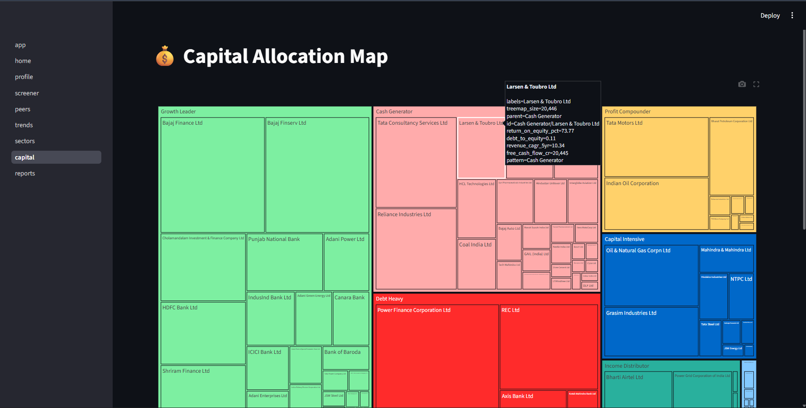
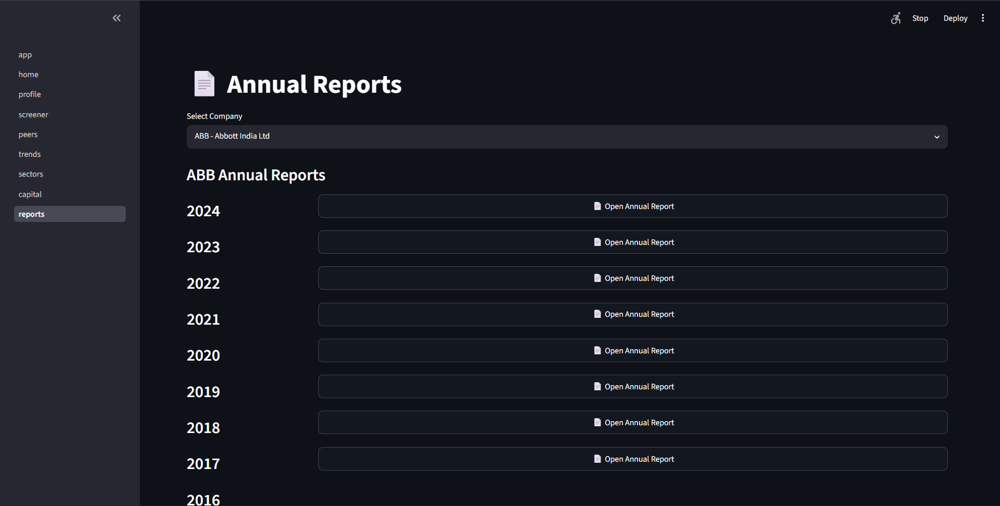

# 📈 Nifty100 Financial Analytics Dashboard

A comprehensive financial analytics platform built using **Python, Pandas, SQLite, and Streamlit** for analyzing Nifty100 companies. The project provides financial ratio analysis, company profiling, peer comparison, stock screening, trend analysis, valuation analytics, and downloadable reports through an interactive dashboard.

---

# 🚀 Features

## 📊 Dashboard Modules

### 🏠 Home Dashboard
- Overall dashboard summary
- Total companies analyzed
- Sector distribution
- Key financial metrics
- Market overview

---

### 🏢 Company Profile
- Company information
- Financial ratios
- Growth metrics
- Profitability analysis
- Balance Sheet summary
- Cash Flow summary

---

### 🔍 Stock Screener
Supports multiple predefined screeners:

- Quality Compounder
- Value Pick
- Growth Accelerator
- Dividend Champion
- Debt-Free Blue Chip
- Turnaround Watch

Features:
- Dynamic filtering
- CSV Export
- Financial metric comparison

---

### 👥 Peer Comparison
Compare companies within the same peer group.

Displays:
- Peer percentile rankings
- Industry benchmark
- Radar chart comparison
- Relative financial performance

---

### 📈 Trend Analysis
Historical visualization of:

- Revenue
- Net Profit
- ROE
- ROCE
- Net Profit Margin
- Free Cash Flow
- Debt to Equity

Interactive trend charts available.

---

### 🏭 Sector Analysis
Sector-wise analytics including:

- Average ROE
- Average ROCE
- Net Profit Margin
- Company comparison
- Sector ranking

---

### 💰 Capital Allocation
Analyze capital deployment using:

- CAPEX
- Free Cash Flow
- Dividend Payout
- Share Buyback
- Cash Conversion

---

### 📄 Reports
Generate and download:

- Valuation Summary
- Valuation Flags
- Screener Results
- Peer Comparison Reports

---

# ⚙️ Technology Stack

| Category | Technology |
|----------|------------|
| Language | Python 3.13 |
| Dashboard | Streamlit |
| Database | SQLite |
| Data Analysis | Pandas |
| Charts | Plotly |
| Excel Reports | OpenPyXL |
| Version Control | Git & GitHub |

---

# 📁 Project Structure

```
nifty100-financial-analytics/
│
├── data/
│   ├── raw/
│   └── processed/
│
├── output/
│   ├── valuation_summary.xlsx
│   └── valuation_flags.csv
│
├── src/
│   ├── analytics/
│   │   └── valuation.py
│   │
│   ├── dashboard/
│   │   ├── app.py
│   │   ├── pages/
│   │   │   ├── 01_home.py
│   │   │   ├── 02_profile.py
│   │   │   ├── 03_screener.py
│   │   │   ├── 04_peers.py
│   │   │   ├── 05_trends.py
│   │   │   ├── 06_sectors.py
│   │   │   ├── 07_capital.py
│   │   │   └── 08_reports.py
│   │   │
│   │   ├── services/
│   │   └── utils/
│   │       └── db.py
│   │
│   ├── reports/
│   ├── screener/
│   └── database/
│
├── nifty100.db
├── requirements.txt
└── README.md
```

---

# 💻 Installation

Move into project

```bash
cd nifty100-financial-analytics
```

Create virtual environment

```bash
python -m venv venv
```

Activate

Windows

```bash
venv\Scripts\activate
```

Linux/Mac

```bash
source venv/bin/activate
```

Install dependencies

```bash
pip install -r requirements.txt
```

---

# ▶️ Run Dashboard

Launch Streamlit

```bash
streamlit run src/dashboard/app.py
```

After launching, open

```
http://localhost:8501
```

---

# 📥 Output Reports

The dashboard generates:

```
output/
├── valuation_summary.xlsx
└── valuation_flags.csv
```

### valuation_summary.xlsx

Contains

- Company Name
- Sector
- P/E Ratio
- P/B Ratio
- EV/EBITDA
- FCF Yield
- 5-Year Median PE
- Sector Median PE
- Valuation Flag

### valuation_flags.csv

Contains companies flagged as:

- Discount
- Caution

---

# 📷 Dashboard Screens

## 🏠 Home Dashboard



---

## 🏢 Company Profile



---

## 🔍 Stock Screener



---

## 👥 Peer Comparison



---

## 📈 Trend Analysis



---

## 🏭 Sector Analysis



---

## 💰 Capital Allocation



---

## 📄 Reports



# 📊 Sprint 4 Retrospective

## UX Decisions

- Multi-page Streamlit architecture
- Sidebar-based navigation
- Cached database queries
- Interactive Plotly charts
- Exportable reports
- Simple and consistent UI

---

## Data Edge Cases

During testing the following cases were identified:

- Companies with limited historical data (for example, JIOFIN)
- Missing CAGR values for recently listed companies
- Duplicate historical ratio entries removed before valuation calculations
- Financial sector metrics handled separately where applicable

---

## Performance Findings

- Dashboard launches successfully
- Company Profile loads within the expected target time
- Cached database queries improve responsiveness
- Interactive charts render smoothly
- Report generation completes successfully

---

## Testing Summary

Completed:

- ✅ All 8 dashboard pages tested
- ✅ Multiple companies verified across sectors
- ✅ Screener presets validated
- ✅ Charts verified
- ✅ Missing data handling verified
- ✅ CSV exports validated
- ✅ Valuation reports verified

---

# 📌 Deliverables

- Streamlit Multi-page Dashboard
- Company Profile Module
- Stock Screener
- Peer Comparison
- Trend Analysis
- Sector Analysis
- Capital Allocation Module
- Reports Module
- Valuation Engine
- Excel Report Generation
- CSV Report Generation

---

# 🎯 Sprint 4 Completion Status

| Task | Status |
|------|--------|
| Dashboard Development | ✅ |
| Company Profile | ✅ |
| Trend Analysis | ✅ |
| Capital Allocation | ✅ |
| Valuation Module | ✅ |
| Integration Testing | ✅ |
| Bug Investigation | ✅ |
| Documentation | ✅ |

---

# 📄 License

This project is developed for educational and internship purposes.

---

# 👨‍💻 Author

**Venkata Srinivasarao Killadi**

B.Tech – Computer Science & Engineering (Data Science)

GitHub: https://github.com/srinukv/nifty100-financial-analytics/

LinkedIn: https://www.linkedin.com/in/venkata-srinivasarao-killadi-6108392ab/

---

⭐ If you found this project useful, consider giving it a star on GitHub.